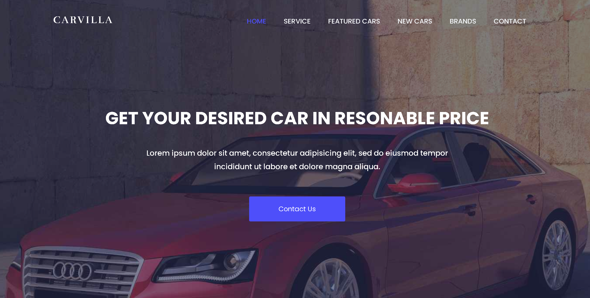

# 🚗 CarVilla – Car Dealership Website

CarVilla is a **responsive car dealership website template** built using **HTML5, CSS3, Bootstrap, and jQuery**.  
It was originally developed using **PHP and MySQL** with **AWS integration**, and later converted into a **static HTML-based version** for performance and deployment efficiency.

---

## 🌟 Features

- ✅ Fully Responsive Design (Mobile & Desktop Friendly)
- 🚀 Built with **Bootstrap 3**
- 🎨 Clean and Modern UI/UX
- 🧩 Dynamic Car Search Panel (filter by year, model, make, and price)
- 🧍 Client Testimonials Carousel
- 🏷️ Featured Cars & New Arrivals Section
- 🏎️ Brand Logo Slider
- ☁️ Integrated with **AWS (Amazon Web Services)** for hosting and storage
- ⚙️ Smooth Animations and Interactive Components

---

## 🛠️ Technologies Used

| Category | Technology |
|-----------|-------------|
| Frontend | HTML5, CSS3, Bootstrap |
| Icons | Font Awesome, Linearicons, Flaticon |
| Fonts | Google Fonts (Poppins, Rufina) |
| Animations | Animate.css |
| JS Plugins | jQuery, Owl Carousel, Bootsnav |
| Backend (Previous Version) | PHP, MySQL |
| Cloud Hosting | AWS EC2, S3 |
| Custom Scripts | custom.js |

---

## 🧩 Project Background

Originally, this project was created using:
- **PHP** (for server-side logic)
- **MySQL** (for storing car listings and contact form data)
- **AWS EC2 & S3** (for hosting and image storage)

Later, the project was **migrated to a static front-end structure** using **pure HTML, CSS, and JS** for faster load time, simplified deployment, and easy GitHub Pages hosting.

---

## 🔄 How PHP + MySQL Was Converted into HTML + CSS + JS

Here’s how the dynamic PHP site was transformed into a static HTML site:

| Step | Description |
|------|--------------|
| **1. Extract Static Layouts** | The HTML structure was copied from the PHP templates (e.g., `header.php`, `footer.php`, `index.php`) and merged into a single `index.html`. |
| **2. Replace PHP Echo/Include** | PHP `<?php include('header.php'); ?>` and dynamic data echoes like `<?php echo $row['car_name']; ?>` were replaced with static HTML tags or placeholders. |
| **3. Static Data Insertion** | Previously database-driven car data (e.g., name, price, image) was hardcoded into HTML blocks under "Featured Cars" and "New Cars" sections. |
| **4. Frontend-Only Enhancements** | Used Bootstrap, jQuery, and Owl Carousel to recreate the same interactivity without backend dependency. |
| **5. AWS Deployment** | The final static site was uploaded to **Amazon S3 (Static Website Hosting)** or hosted on an **EC2 instance** using Apache or Nginx. |

This conversion makes the site **lighter, faster, and ideal for portfolio and presentation purposes**.

---

## 📁 Project Structure

```
CarVilla/
│
├── index.html                # Main landing page
│
├── assets/
│   ├── css/                  # Stylesheets (Bootstrap, Fonts, Animations)
│   ├── js/                   # JavaScript files (Bootstrap, Owl Carousel, Custom)
│   ├── images/               # Car and brand images
│   ├── logo/                 # Favicon and logo
│   └── fonts/                # Web fonts
│
└── README.md                 # Project documentation
```

---

## ⚙️ How to Run Locally

1. **Clone the Repository**
   ```bash
   git clone https://github.com/Parthadee/CarVilla.git
   ```

2. **Navigate into the Project**
   ```bash
   cd CarVilla
   ```

3. **Open in Browser**
   Simply open `index.html` in your browser, or use **VS Code Live Server** for an enhanced experience.

4. *(Optional)* **Deploy to AWS S3**
   - Upload your static files to an S3 bucket  
   - Enable “Static Website Hosting” in S3 properties  
   - Make the bucket public or use CloudFront for CDN distribution

---

## 🖼️ Preview

Add your own project preview image:

```markdown

```

---

## 📄 License

This project is based on a free template by [Themesine](https://www.themesine.com/).  
You can modify and use it for **personal or educational projects**.

---

## 👨‍💻 Author

**Partha Dey**  
💼 AWS Solution Architect Intern | UI/UX Designer  
🌐 [Portfolio](https://parthadee.github.io/Portfolio/)  
🔗 [LinkedIn](https://www.linkedin.com/in/parthakrdey/)  
📧 parthadey@email.com

---

## 🙌 Acknowledgments

- [Themesine](https://www.themesine.com/) – Original Template Design  
- [Bootstrap](https://getbootstrap.com/) – Frontend Framework  
- [Font Awesome](https://fontawesome.com/) – Icons  
- [AWS](https://aws.amazon.com/) – Hosting and Cloud Infrastructure  
- [Owl Carousel](https://owlcarousel2.github.io/OwlCarousel2/) – Carousel Plugin  

---

### ⭐ If you found this project useful, please star the repo to show your support!
